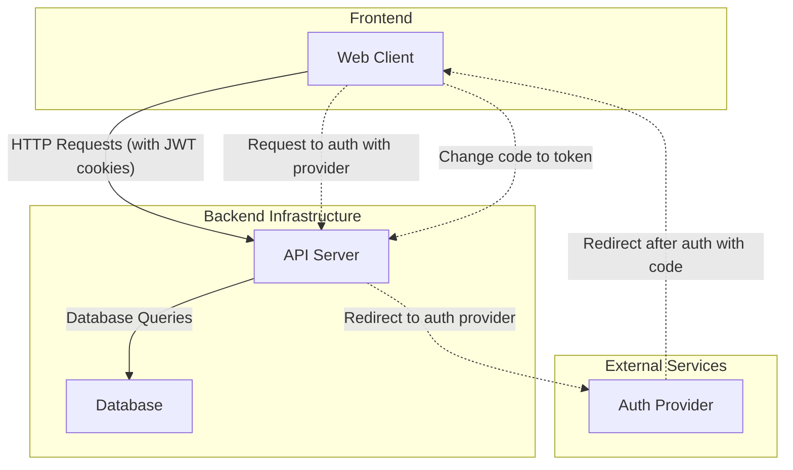

## User Stories

- Как пользователь, я могу зарегистрироваться/войти в систему.
- Как пользователь, я могу создать новую группу.
- Как создатель группы, я могу пригласить других пользователей в группу (например, по email или сгенерировав уникальную ссылку).
- Как участник группы, я могу добавить расход, указав сумму и кто заплатил.
- Как участник группы, я могу видеть список всех расходов в группе.
- Как участник группы, я могу видеть простой дашборд с итоговым балансом: кто кому и сколько должен.
- Как участник группы, я могу отметить, что я погасил свой долг перед другим участником (или что мне вернули долг).

## Non-Functional Requirements

- Reliability - не высокая, так как это не критичный сервис. И поскольку это MVP, то список пользователей будет небольшим.
- Cost - бюджет на хостинг в месяц как можно меньше. Это практически pet-проект
- Maintainability - будет работать один разработчик, поэтому поддержка будет происходить в свободное время.
- Scalability - в первые месяцы будет не более 10-15 пользователей.
- Security - для удобства пользователей и снижения сложности проекта мы не будем хранить и управлять паролями пользователей. Мы будем хранить идентификаторы пользователей, информацию о группах и расходах, историю изменений.

## Component Diagram

## Data Schema

### Table: Users
- id (PK, UUID)
- email (VARCHAR, UNIQUE)
- name (VARCHAR)
- created_at (TIMESTAMP)

### Table: Groups
- id (PK, UUID)
- name (VARCHAR)
- created_at (TIMESTAMP)
- owner_id (FK, UUID -> Users.id)

### Table: Expenses
- id (PK, UUID)
- group_id (FK, UUID -> Groups.id)
- total_amount (DECIMAL)
- payer_id (FK, UUID -> Users.id)
- created_at (TIMESTAMP)

### Table: ExpenseShares
- id (PK, UUID)
- expense_id (FK, UUID -> Expenses.id)
- user_id (FK, UUID -> Users.id)
- amount (DECIMAL)
- created_at (TIMESTAMP)

### Table: Settlements
- id (PK, UUID)
- group_id (FK, UUID -> Groups.id)
- payer_id (FK, UUID -> Users.id)
- receiver_id (FK, UUID -> Users.id)
- amount (DECIMAL)
- created_at (TIMESTAMP)

## Balance Calculation Strategy
Пользователь добавляет расход, указывая сумму и кто заплатил. Так же может указать участников расхода и сумму, которую который каждый участник должен заплатить. По-умолчанию, если не указано, то каждый участник должен заплатить поровну.

Когда пользователь погашает долг, то система создаёт запись в таблице Settlements с суммой погашения и id пользователя, который погасил долг и id пользователя, которому погасил долг.

После этого система рассчитывает баланс между участниками. Баланс рассчитывается по следующему алгоритму:
- Для каждого участника (user_A) считаем общую сумму, которую он должен всем остальным. Это SUM(ExpenseShares.amount) где user_id = user_A.id.
- Для каждого участника (user_A) считаем общую сумму, которую он заплатил за всех. Это SUM(Expenses.total_amount) где payer_id = user_A.id.
- Для каждого участника (user_A) считаем общую сумму, которую он отдал в качестве погашения. Это SUM(Settlements.amount) где payer_id = user_A.id.
- Для каждого участника (user_A) считаем общую сумму, которую он получил в качестве погашения. Это SUM(Settlements.amount) где receiver_id = user_A.id.

Итоговый баланс для user_A = (Сколько он заплатил за всех + Сколько он получил погашений) - (Сколько он должен по всем расходам + Сколько он отдал погашений).

